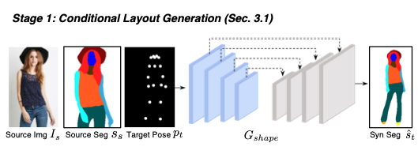
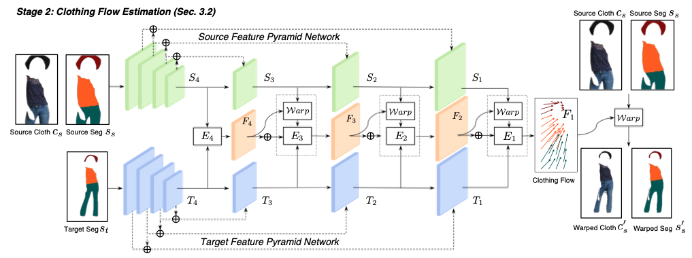
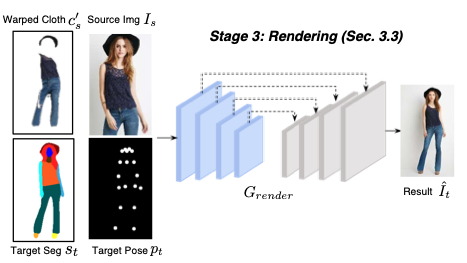

Implementation Clothflow (Here is a paper's [link](http://openaccess.thecvf.com/content_ICCV_2019/papers/Han_ClothFlow_A_Flow-Based_Model_for_Clothed_Person_Generation_ICCV_2019_paper.pdf).)
# Stage 0
We used a MVC dataset. Please download this first.
* ## Resize
Image's original size is (1920, 2240), but this is too big to learn for computer. So, we need to resize this.

Before run this code, you must be set `TARGET_SIZE` and `base_dir`.

```python
python resize.py
```

* ## Segmentation
Use opensource for segmentation. You must save images in 'p','1','2',3',... in image folder. 

We use LIP_JPPNet.
> (128,0,0),(255,0,0),(0,85,0),(170,0,51),(255,85,0)  
> 1=Hat, 2=Hair, 3=Glove, 4=Sunglasses, 5=UpperClothes  
> (0,0,85),(0,119,221),(85,85,0),(0,85,85),(85,51,0)  
> 6=Dress, 7=Coat, 8=Socks, 9=Pants, 10=Jumpsuits  
> (52,86,128),(0,128,0),(0,0,255),(51,170,221),(0,255,255)  
> 11=Scarf, 12=Skirt, 13=Face, 14=LeftArm, 15=RightArm  
> (85,255,170),(170,255,85),(255,255,0),(255,170,0)]  
> 16=LeftLeg, 17=RightLeg, 18=LeftShoe, 19=RightShoe  

* ## Pose
Use opensource for pose. You must save images in 'p','1','2',3',... in image folder. 

We use pytorch_Realtime_Multi-Person_Pose_Estimation.

* ## Crop
Crop clothes from person's image.

Before run this code, you must be set `TARGET_SIZE`, `IS_TOPS`, `base_dir`. The meaning of `IS_TOPS` is whether you are learning tops or bottoms.
```python
python crop.py
```
* ## Split
Split train data and test data.

Before run this code, you must be set `base_dir`.

```python
python stage0/split.py
```

* ## Make pair txt
Make pair in same clothes image.

Before run this code, you must be set `base_dir`.
```python
python mkpairtxt.py
```

# Hyper Parameters
It is in `utils.py`.
* ### PWD
    * your repository's full path
    * str(ex : '/home/fashionteam/ClothFlow/')
* ### IS_TOPS
    * whether to wear tops or bottoms
    * bool(ex : True)
* ### REAL_TEST
    * test for training or not 
    * bool(ex : True)
* ### TENSORBOARD
    * how to display for you(tensorboard or console log)
    * bool(ex : True)

# Stage 1
**Change condition cloth mask to target cloth mask**


* ## Train
```python
python stage1/train.py
```
* ## Warped_Mask
```python
python stage1/test.py
```
-> result/warped_mask & test/warped_mask
# Stage 2
**Warp**

* ## Train
We need a `warped_mask` folder.
```python
python stage2/train.py
```
* ## Warped_Cloth
```python
python stage2/test.py
```
-> result/warped_cloth & test/warped_cloth
# Stage 3
**wear cloth**

* ## Train
We need `warped_mask`, `warped_cloth` folders.
```python
python stage3/train.py
```
* ## Final Result
```python 
python stage3/test.py
```
-> result/final & test/final

# Inference
```python
python inference.py
```